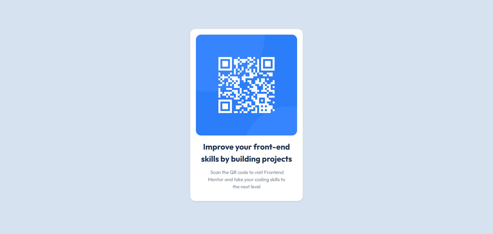

# Frontend Mentor - QR code component solution

This is a solution to the [QR code component challenge on Frontend Mentor](https://www.frontendmentor.io/challenges/qr-code-component-iux_sIO_H). Frontend Mentor challenges help you improve your coding skills by building realistic projects.

## Table of contents

- [Overview](#overview)
  - [Screenshot](#screenshot)
  - [Links](#links)
- [My process](#my-process)
  - [Built with](#built-with)
  - [What I learned](#what-i-learned)
  - [Continued development](#continued-development)
  - [Useful resources](#useful-resources)
- [Author](#author)
- [Acknowledgments](#acknowledgments)

## Overview

### Screenshot



### Links

- Solution URL: [Bootstrap](https://getbootstrap.com/)

## My process

### Built with

- Semantic HTML5 markup
- CSS custom properties
- [Bootstrap](https://getbootstrap.com/) - For styles

### What I learned

white-space: pre; digunakan dengan span sebagai penanda untuk teks yang ingin dibuat menjadi beberapa baris.

@media (min-width: 375px) { ... } : digunakan untuk menentukan lebar minimal dari layar browser yang digunakan untuk memberikan efek css tertentu pada lebar yang sudah ditentukan.

```html
<h1>Some HTML code I'm proud of</h1>
```

```css
.figure-caption.paragraf span {
  white-space: pre;
}

@media (min-width: 375px) {
  .figure {
    width: 350px;
  }
}
```

### Continued development

Maybe in the future i will change the image with QR code that contain my portfolio website link, so that everyone can access my website like portfolio or my projects much more easier.

### Useful resources

- [Bootstrap](https://getbootstrap.com/) - This helped me to do the styling more easy. I really liked this bootstrap and will use it going forward.
- [Vercel](https://vercel.com) - This is an amazing website which helped me to upload my website into the internet. I'd recommend it to anyone still learning to use this website.

## Author

- Website - [AbalJerind](https://qr-code-main-three.vercel.app/)
- Frontend Mentor - [@Abaljerind](https://www.frontendmentor.io/profile/Abaljerind)

## Acknowledgments

I want to thank me for believing in me, I want to thank me for doing all this hard work. I wanna thank me for having no days off. I wanna thank me for never quitting. I wanna thank me for being me at all times.
